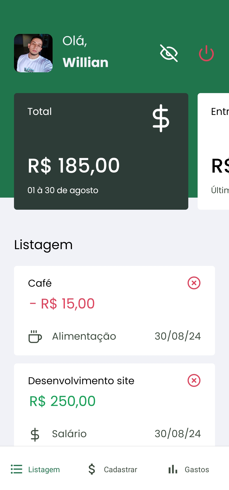
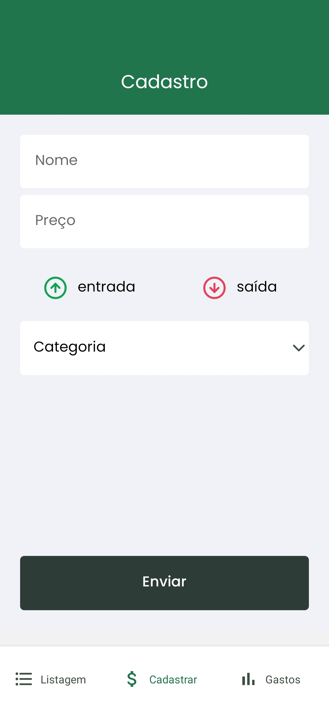
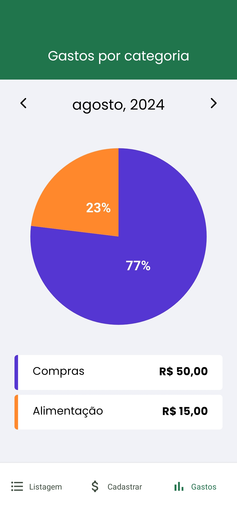

# Go Finances
### 📝 O Go Finances se trata de uma aplicação para controle de finanças, o app possui gráficos de gastos, cadastro de entradas e saídas e também login social utilizando OAuth do Google.

| Login | Dashboard | Cadastro | Gráfico |
| --- |---|---|---|
|  |  |  |  |

## 🛠️ Desenvolvido utilizando React Native e Expo.

## 😄 Feito por Willian Mafra com base no curso da Rocketseat

 
